# 🚀 Serverless Task Management API

**Production-grade REST API built with AWS Lambda, API Gateway, and DynamoDB**

[](https://aws.amazon.com/)
[](https://www.python.org/)
[](LICENSE)

---

## 📋 Table of Contents

- [Overview](#overview)
- [Architecture](#architecture)
- [Features](#features)
- [Tech Stack](#tech-stack)
- [Project Structure](#project-structure)
- [Setup & Deployment](#setup--deployment)
- [API Documentation](#api-documentation)
- [Cost Analysis](#cost-analysis)
- [Lessons Learned](#lessons-learned)
- [Portfolio](#portfolio)

---

## 🎯 Overview

A complete serverless REST API for task management demonstrating modern cloud architecture patterns. This project showcases:

- ✅ **Serverless compute** with AWS Lambda (Python)
- ✅ **REST API** with API Gateway
- ✅ **NoSQL database** with DynamoDB (GSI for efficient queries)
- ✅ **Event-driven notifications** via SNS
- ✅ **Comprehensive monitoring** with CloudWatch
- ✅ **IAM security** with least-privilege permissions

**Built by:** Debbie Oben  
**Date:** April 2026  
**Cost:** ~$0.05 for demo

---

## 🏗️ Architecture

```
┌─────────┐      ┌──────────────┐      ┌────────────┐      ┌──────────┐
│ Client  │─────▶│ API Gateway  │─────▶│   Lambda   │─────▶│ DynamoDB │
│ (HTTP)  │      │  (REST API)  │      │ Functions  │      │  Table   │
└─────────┘      └──────────────┘      └────────────┘      └──────────┘
                                              │
                                              │
                                              ▼
                                        ┌──────────┐
                                        │   SNS    │──▶ 📧 Email
                                        │  Topic   │
                                        └──────────┘
                                              │
                                              ▼
                                        ┌──────────┐
                                        │CloudWatch│
                                        │Logs/Alarms│
                                        └──────────┘
```

### Request Flow

1. Client sends HTTP request to API Gateway endpoint
2. API Gateway validates and routes to appropriate Lambda function
3. Lambda function processes request (validates, transforms data)
4. Lambda interacts with DynamoDB (CRUD operations)
5. CreateTask Lambda publishes notification to SNS topic
6. SNS sends email to subscribed addresses
7. Lambda returns response to API Gateway
8. API Gateway returns HTTP response to client
9. All operations logged to CloudWatch

---

## ✨ Features

### CRUD Operations
- **Create Task** - Generate UUID, save to DynamoDB, send email notification
- **Get Task** - Retrieve specific task by ID
- **List Tasks** - Paginated list of all tasks
- **Update Task** - Partial updates with automatic timestamp management
- **Delete Task** - Remove task from database

### Database Design
- **Primary Key:** `taskId` (UUID) + `createdAt` (timestamp)
- **Global Secondary Index:** `userId-createdAt-index` for user-based queries
- **On-demand capacity** for automatic scaling

### Notifications
- **SNS email alerts** when tasks are created
- **Formatted messages** with task details (ID, title, description, priority, status, assigned user, timestamp)

### Monitoring
- **CloudWatch Logs** for all Lambda functions
- **CloudWatch Metrics** (invocations, errors, duration, throttles)
- **CloudWatch Alarms** for error notifications
- **Optional Dashboard** for visualizing API health

---

## 🛠️ Tech Stack

| Component | Technology | Purpose |
|-----------|-----------|---------|
| Compute | AWS Lambda (Python 3.12) | Serverless function execution |
| API | API Gateway (REST) | HTTP endpoint management |
| Database | DynamoDB | NoSQL data persistence |
| Notifications | SNS | Email alerts |
| Monitoring | CloudWatch | Logs, metrics, alarms |
| Security | IAM | Access control & permissions |

**Python Libraries:**
- `boto3` - AWS SDK
- `uuid` - Task ID generation
- `datetime` - Timestamp management
- `json` - Request/response parsing

---

## 📁 Project Structure

```
project05-serverless-api/
├── lambda-functions/
│   ├── CreateTask.py       # POST /tasks - Create new task
│   ├── GetTask.py          # GET /tasks/{id} - Get single task
│   ├── ListTasks.py        # GET /tasks - List all tasks
│   ├── UpdateTask.py       # PUT /tasks/{id} - Update task
│   └── DeleteTask.py       # DELETE /tasks/{id} - Delete task
├── iam-policies/
│   ├── dynamodb-policy.json  # DynamoDB read/write permissions
│   └── sns-policy.json       # SNS publish permissions
├── docs/
│   ├── dynamodb-schema.md    # Database schema and access patterns
│   ├── api-endpoints.md      # API reference documentation
│   └── setup-guide.md        # Step-by-step deployment guide
├── architecture/
│   └── architecture-diagram.png  # System architecture visual
├── README.md                 # This file
└── Project_05_Serverless_API.pdf  # Full project documentation
```

---

## 🚀 Setup & Deployment

### Quick Start

1. **Clone repository**
```bash
git clone https://github.com/debbieoben/project05-serverless-api.git
cd project05-serverless-api
```

2. **Follow setup guide**
```bash
# See detailed instructions in docs/setup-guide.md
```

3. **Update configuration**
- Replace `YOUR-ACCOUNT-ID` in IAM policies
- Update `SNS_TOPIC_ARN` in CreateTask.py
- Configure AWS CLI credentials

4. **Deploy infrastructure**
- Create DynamoDB table
- Create SNS topic and subscribe email
- Create IAM execution role
- Deploy Lambda functions
- Configure API Gateway
- Set up CloudWatch alarms

### Prerequisites

- AWS Account
- AWS CLI configured
- Python 3.12
- Basic AWS knowledge (Lambda, API Gateway, DynamoDB)

**Full deployment instructions:** [docs/setup-guide.md](docs/setup-guide.md)

---

## 📚 API Documentation

### Base URL
```
https://[api-id].execute-api.us-east-1.amazonaws.com/dev
```

### Endpoints

| Method | Endpoint | Description |
|--------|----------|-------------|
| POST | `/tasks` | Create new task |
| GET | `/tasks` | List all tasks (limit: ?limit=N) |
| GET | `/tasks/{id}` | Get specific task |
| PUT | `/tasks/{id}` | Update task (partial) |
| DELETE | `/tasks/{id}` | Delete task |

### Example Request

```bash
curl -X POST https://your-api.execute-api.us-east-1.amazonaws.com/dev/tasks \
  -H "Content-Type: application/json" \
  -d '{
    "userId": "alice",
    "title": "Deploy serverless API",
    "description": "Complete AWS project",
    "priority": "high",
    "status": "in-progress"
  }'
```

### Example Response

```json
{
  "message": "Task created successfully",
  "task": {
    "taskId": "550e8400-e29b-41d4-a716-446655440000",
    "userId": "alice",
    "title": "Deploy serverless API",
    "description": "Complete AWS project",
    "priority": "high",
    "status": "in-progress",
    "createdAt": 1712160000,
    "updatedAt": 1712160000
  }
}
```

**Complete API reference:** [docs/api-endpoints.md](docs/api-endpoints.md)

---

## 💰 Cost Analysis

### Demo Cost: ~$0.05

| Service | Usage | Cost |
|---------|-------|------|
| Lambda | ~50 invocations | $0.00 (free tier) |
| API Gateway | ~50 requests | $0.00 (free tier) |
| DynamoDB | ~100 operations | $0.00 (free tier) |
| SNS | ~10 emails | $0.00 (free tier) |
| CloudWatch | Logs + 1 alarm | $0.02 |
| Data Transfer | Minimal | $0.03 |

### Production Estimate: ~$2.30/month (100K requests)

- **Lambda:** $0.20
- **API Gateway:** $0.35
- **DynamoDB:** $1.25
- **CloudWatch:** $0.50
- **SNS:** $0.00 (free tier)

**Cost optimization strategies:**
- Use DynamoDB reserved capacity for predictable workloads
- Set CloudWatch Logs retention policies
- Implement API Gateway caching
- Monitor and delete unused resources

---

## 📖 Lessons Learned

### Key Takeaways

1. **Serverless Requires Different Thinking**
   - Cold starts matter for latency-sensitive endpoints
   - Stateless functions require external state management
   - Pay-per-use pricing changes optimization priorities

2. **IAM Permissions Are Critical**
   - Every Lambda-to-service interaction needs explicit permissions
   - Resource-level permissions are more secure than wildcards
   - Testing often requires iterative policy additions

3. **DynamoDB Design Differs from SQL**
   - Primary key design impacts performance and costs
   - GSIs enable access patterns but double write costs
   - Scan operations should be avoided in production

4. **Error Handling Must Be Explicit**
   - Comprehensive try-catch blocks prevent 500 errors
   - Defensive programming (null checks) prevents cryptic errors
   - CloudWatch logging is essential for debugging

5. **Integration Testing Is Crucial**
   - Console test format differs from real API requests
   - Unit tests miss integration issues
   - End-to-end testing reveals UX problems

### What I Would Do Differently

- Implement Cognito authentication from start
- Use Lambda Layers for shared code
- Define infrastructure with Terraform/CloudFormation
- Add comprehensive unit tests with moto
- Implement request/response validation
- Use single-table DynamoDB design
- Add proper pagination with cursors
- Set up CI/CD pipeline for automated deployment

---

## 🎓 Skills Demonstrated

- ✅ Serverless architecture design
- ✅ AWS Lambda development (Python)
- ✅ API Gateway REST API configuration
- ✅ DynamoDB data modeling (partition keys, sort keys, GSI)
- ✅ IAM role and policy management
- ✅ SNS pub/sub messaging
- ✅ CloudWatch logging, metrics, alarming
- ✅ Error handling in distributed systems
- ✅ RESTful API design
- ✅ Cost optimization for serverless workloads

---

## 📂 Portfolio

This is **Project 5** of my AWS DevOps Portfolio.

**Other Projects:**
1. [WebSocket Multiplayer Game](https://github.com/debbieoben/project01-websocket-game) - Real-time multiplayer with AppSync
2. [S3 Static Website](https://github.com/debbieoben/project02-s3-static-site) - CloudFront CDN distribution
3. [Production VPC](https://github.com/debbieoben/project03-production-vpc) - Multi-AZ network architecture
4. [CI/CD Pipeline](https://github.com/debbieoben/project04-cicd-pipeline) - Automated deployment with CodePipeline

**Total Portfolio:**
- 📄 156+ pages of documentation
- 💰 $0.80 total cost for demos
- 🎯 5 complete production-grade projects

---

## 📧 Contact

**Debbie Oben**
- GitHub: [@debbieoben](https://github.com/debbieoben)
- LinkedIn: [linkedin.com/in/debbieoben](https://linkedin.com/in/debbieoben)
- Email: debbie.oben@example.com

---

## 📄 License

This project is part of a portfolio and is available for educational purposes.

---

## 🙏 Acknowledgments

- AWS Documentation for serverless best practices
- AWS Free Tier for enabling cost-effective learning
- Python boto3 SDK for simplified AWS interactions

---

**⭐ If this project helped you learn serverless architecture, please star the repository!**

---

## 📸 Project Screenshots

### 🏗️ System Architecture

*Complete serverless architecture showing API Gateway, Lambda, DynamoDB, SNS, and CloudWatch integration*

---

### 🗄️ DynamoDB Table Configuration

*TaskManagementAPI table with composite primary key (taskId + createdAt) and GSI configuration*

---

### 📊 DynamoDB Table Items

*Sample tasks stored in DynamoDB with all attributes including status, priority, and timestamps*

---

### ⚡ Lambda Functions Overview
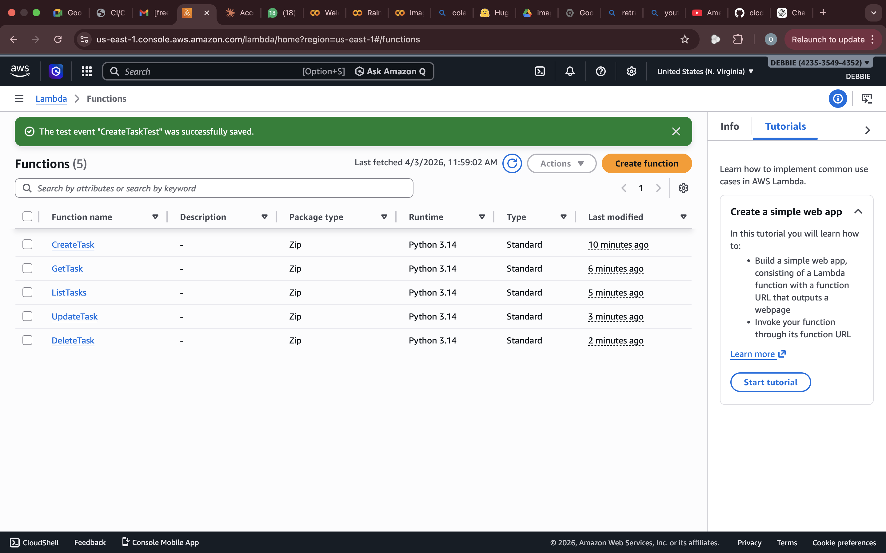
*All 5 Python Lambda functions handling complete CRUD operations*

---

### 💻 CreateTask Lambda Function
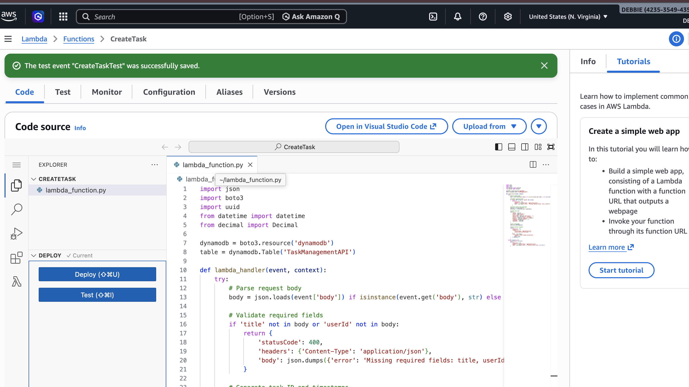
*Python code showing task creation, DynamoDB write, and SNS notification integration*

---

### 🔐 Lambda Execution Role
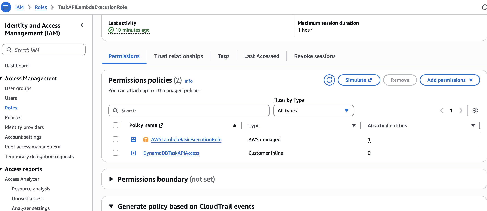
*TaskAPILambdaExecutionRole with DynamoDB and SNS permissions*

---

### 🌐 API Gateway Resources Tree
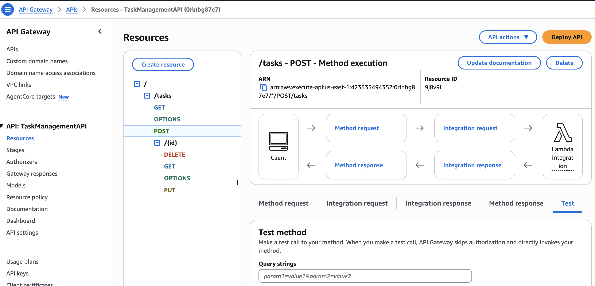
*REST API resource tree with all CRUD endpoints and OPTIONS methods for CORS*

---

### 🔗 POST /tasks Method Integration
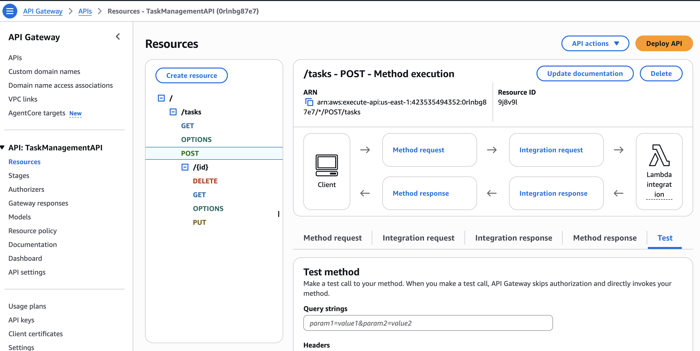
*CreateTask Lambda integration with proxy integration enabled*

---

### 🚀 API Gateway Dev Stage
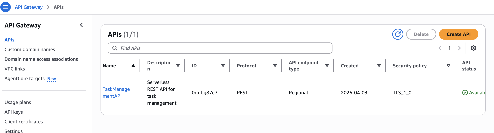
*API deployed to 'dev' stage with production-ready Invoke URL*

---

### ✅ API Test - Create Task Success
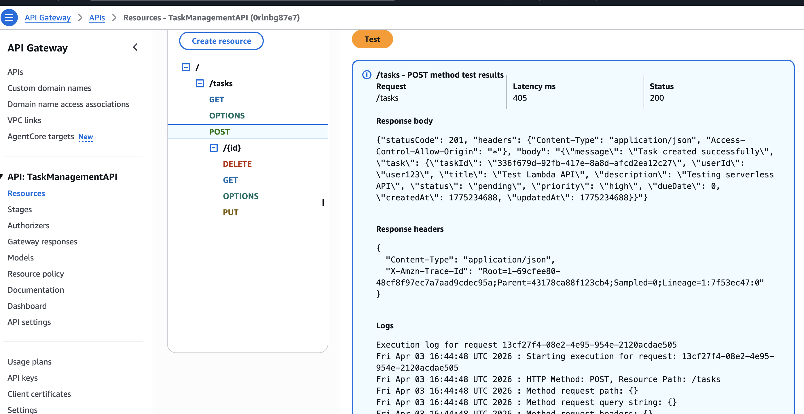
*Successful task creation showing 201 status code and complete task object response*

---

### 📋 DynamoDB Task Created
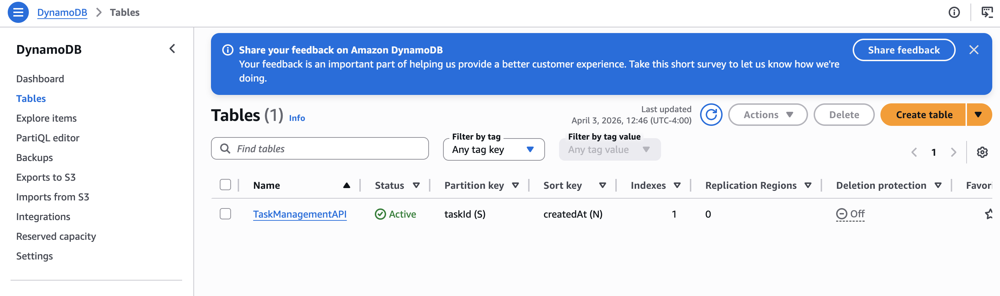
*Newly created task visible in DynamoDB table with all attributes populated*

---

### 🔄 API Test - List Tasks Success
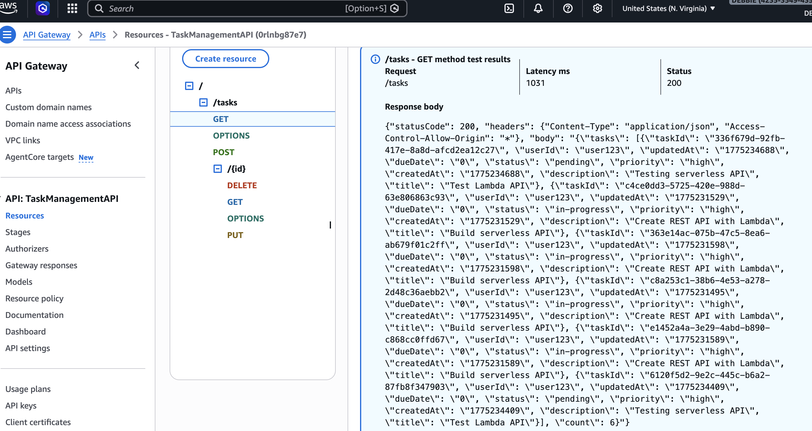
*Successful retrieval of all tasks with count and array of task objects*

---

### 📧 SNS Topic Configuration
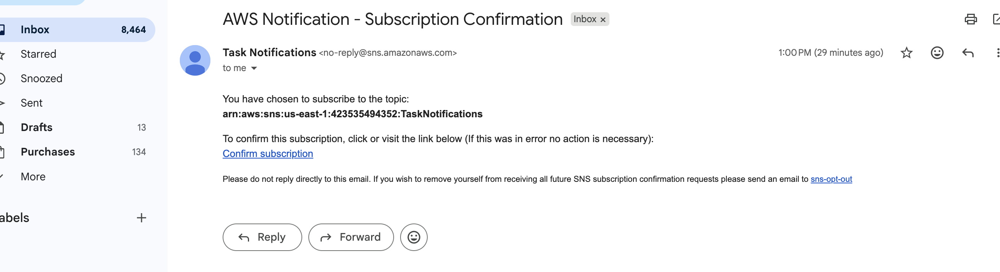
*TaskNotifications SNS topic with confirmed email subscription for real-time alerts*

---

### 📨 CloudWatch Alarms List
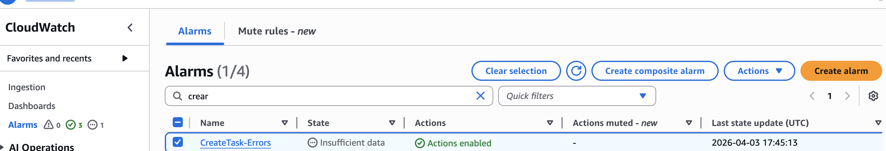
*CreateTask-Errors alarm configured to trigger on Lambda function errors*

---

### 📊 CloudWatch Dashboard
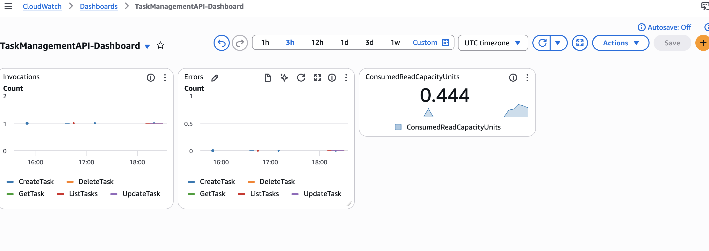
*Custom dashboard showing Lambda invocations, errors, and API metrics*

---

### 📬 Email Notification Received
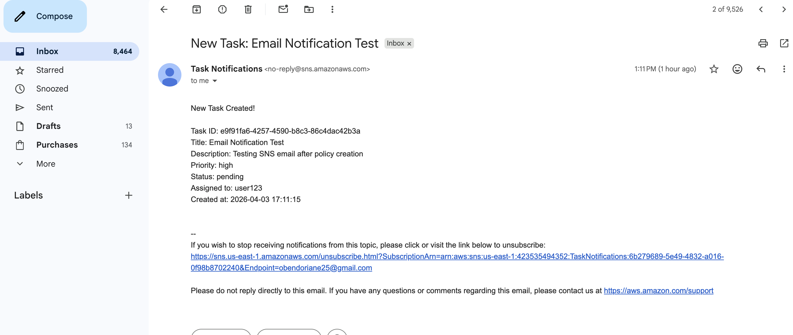
*Automated email notification sent when new task is created, including all task details*

---

### 📈 CloudWatch Log Stream
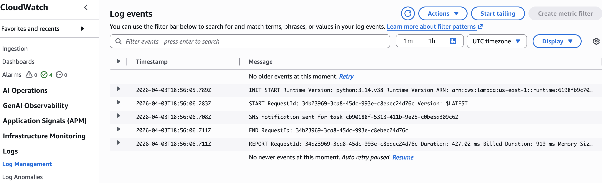
*Detailed execution logs showing successful task creation and SNS publish confirmation*

---

### 🌐 API Invoke URL

*Production endpoint URL for accessing the deployed REST API*

---

### 🎯 Complete API Structure
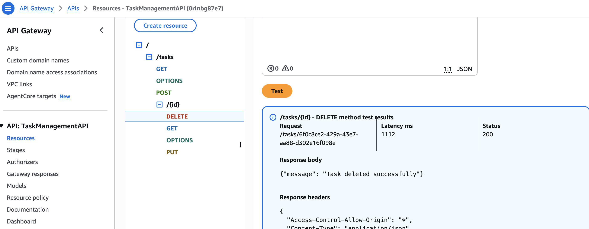
*Comprehensive view of all API resources, methods, and integrations*

---
